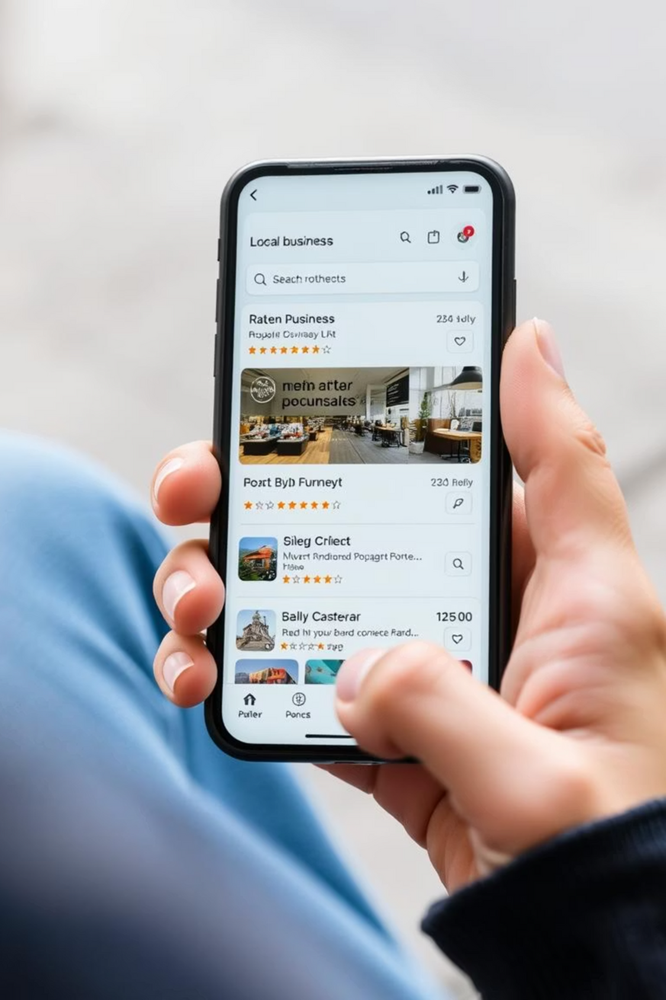

# 🌐 Local Connect Website

Local Connect is a **community-driven business directory and review platform** designed to make it easy for people to discover, connect, and support local businesses.
This web app helps users search for businesses by category or location, read reviews, and share their own experiences.

---

## ✨ Features

- 🔍 **Business Directory** – Browse local businesses with categories and search filters.
- 📝 **Reviews & Ratings** – Leave star ratings and written feedback.
- 📍 **Interactive Maps** – View business locations on a map (Google Maps / OpenStreetMap).
- 📱 **Responsive Design** – Works smoothly on desktop and mobile.
- ❤️ **Favorites** – Save your favorite businesses for quick access.
- 👤 **User Profiles** – Business owners can manage listings; customers can post reviews.
- 🏆 **Highlights** – See top-rated businesses, new additions, and trending spots.

---

## 🚀 Future Improvements

- ✅ Business verification badges
- ✅ Appointment booking system (e.g., salons, clinics, mechanics)
- ✅ Event board for promotions and community activities
- ✅ Offline-first mode (Progressive Web App)
- ✅ Mobile Money (MoMo) integration for payments

---

## 🛠️ Tech Stack

- **Frontend:** HTML5, CSS3 (TailwindCSS), JavaScript (VanillaJS or React)
- **Backend:** Node.js + Express (REST API)
- **Database:** SQLite (for development) / PostgreSQL (for deployment)
- **Maps:** Google Maps API or OpenStreetMap (Leaflet.js)
- **Auth:** JWT / Firebase Authentication

---

## 📦 Installation

1. Clone the repository:
   ```bash
   git clone https://github.com/your-username/local-connect.git
   cd local-connect




